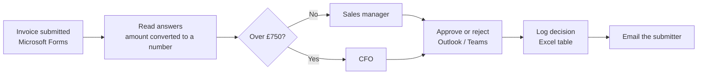

# Invoice Approval Automation (Power Automate)

A low-code workflow that automates invoice approvals using Microsoft 365. An invoice submitted through a form is routed to the right approver based on its amount, approved or rejected in one click, logged for audit, and the submitter is told the outcome automatically.

> Built as a learning project to develop my Power Platform and automation skills. This is a prototype. All data in this repository is fictional test data, and screenshots have been redacted to remove personal details.

---

## The problem

In many small and medium-sized businesses, invoice approvals still run on email and paper. PDFs get forwarded around, approvals get chased, and details are retyped into spreadsheets. Invoices get lost, suppliers get paid late, and there's no reliable record of who approved what.

## What it does

- Collects invoice details through a Microsoft Form: supplier name, invoice reference number, department, amount (£), reason for the invoice, and an optional photo of the invoice
- Applies an approval rule: invoices **over £750 go to the CFO**, everything else goes to the **Sales manager**
- Sends an approve/reject request in Outlook or Teams with all the invoice details, and waits for a decision
- Lets the approver add a comment, such as the reason for a rejection
- Logs every decision (who submitted it, amount, route, outcome and comments) in an Excel table
- Emails the submitter the outcome and any comments

## How it works



### Flow steps

1. **Trigger:** When a new response is submitted (Microsoft Forms)
2. **Get response details:** reads the form answers
3. **Compose (Amount Text):** captures the amount, which Forms returns as text
4. **Initialize variables:** `varAmount` (Float), `varApprover` (String), `varRoute` (String)
5. **Condition:** if `varAmount` is greater than 750, set the approver and route to the CFO; otherwise set them to the Sales manager
6. **Start and wait for an approval:** Approve/Reject, first to respond, assigned to `varApprover`
7. **Add a row into a table:** writes the decision to the `Invoicelog` table in Excel
8. **Send an email (V2):** tells the submitter the outcome and the approver's comments

## Tested with two invoices

| Test | Supplier | Ref | Amount | Route | Outcome | Comment |
| --- | --- | --- | --- | --- | --- | --- |
| 1 | Acme packaging | INV-1001 | £250 | Sales manager (under £750) | Approved | none |
| 2 | Chem supplies ltd | INV-1002 | £1,250 | CFO (over £750) | Rejected | "Needs invoice file submission." |

Both routes worked: the small invoice went to the Sales manager, the large one to the CFO, and each submitter received an outcome email. The expected log output is in [`sample-data/invoice-log-sample.csv`](sample-data/invoice-log-sample.csv).

## Screenshots

### The flow


### Submission form


### Approval request: test 1 (£250, Sales manager)


### Approval request: test 2 (£1,250, CFO), rejected with a comment


### Result email to the submitter


### Audit log


## Built with

| Tool | Used for |
| --- | --- |
| Microsoft Forms | Invoice submission |
| Power Automate (cloud flow) | Workflow, routing logic and approvals |
| Approvals | Approve/reject requests in Outlook and Teams |
| Excel Online (Business) | Audit log |
| Office 365 Outlook | Notifications |

## Key expressions

```
# Convert the amount from text to a number
float(outputs('Amount_Text'))

# Timestamp in UK time (handles GMT/BST)
convertFromUtc(utcNow(), 'GMT Standard Time', 'dd/MM/yyyy HH:mm')

# Approver's comments
first(outputs('Start_and_wait_for_an_approval')?['body/responses'])?['comments']

# Approver's name
first(outputs('Start_and_wait_for_an_approval')?['body/responses'])?['responder']?['displayName']

# Outcome as a word for the email
if(equals(outputs('Start_and_wait_for_an_approval')?['body/outcome'], 'Approve'), 'approved', 'rejected')
```

The build guide in [docs/build-guide.md](docs/build-guide.md) lists every step and expression. It uses £500 as its example threshold; this build uses £750.

## Security and privacy considerations

- **Stays inside Microsoft 365.** Invoice data is never sent to a third-party service.
- **Identity on every submission.** The form only accepts signed-in users from the organisation, so each invoice is tied to a named person.
- **Controlled approval rights.** Only the named approver for each route can approve, and every decision is logged with a timestamp, giving an audit trail.
- **No secrets or personal data in this repository.** Screenshots are redacted, the sample data uses placeholder identities, and the exported flow uses placeholder email addresses.
- **In production I would:**
  - store the log in a SharePoint list with restricted permissions, not a personal OneDrive file
  - run the flow under a dedicated service account, not a personal account
  - apply least privilege to who can view and edit the log

## Business value

- **Control:** approval limits are applied every time
- **Audit trail:** a record of who approved what, when, and why it was rejected
- **Speed:** fewer invoices lost in inboxes and fewer late payments
- **Visibility:** one place to see what's pending or decided
- **Accuracy:** no retyping of figures
- **Cost:** built on standard Microsoft 365 tools, with no extra software

## Limitations

- Prototype tested with two sample invoices, not at production scale
- Log stored in an Excel file in OneDrive
- One approver per route
- The form accepts a photo of the invoice, but the flow doesn't yet pass it to the approver or the log

## Future improvements

- [ ] Attach the invoice file to the approval request and record it in the log
- [ ] Escalate to a backup approver if there's no response within 2 days
- [ ] Require two sign-offs above a higher threshold
- [ ] Power BI dashboard showing approved spend by department
- [ ] Integration with an accounting or ERP system

## Repository structure

```
invoice-approval-power-automate/
├── README.md
├── docs/
│   ├── build-guide.md          # Step-by-step build instructions
│   └── images/                 # Redacted screenshots used in this README
├── flow/
│   └── InvoiceApproval.zip     # Exported flow package (sanitised)
└── sample-data/
    └── invoice-log-sample.csv  # Expected log output (fictional data)
```

## Try it yourself

**Requirements:** a Microsoft 365 work or school account with Power Automate, Forms and Excel Online.

- **Option A, import:** in Power Automate, go to **My flows → Import → Import Package (Legacy)**, upload `flow/InvoiceApproval.zip`, create or select your connections, then point the trigger at your own form and the Excel step at your own workbook. You'll need to re-select the form answers in each step, because a new form has new question IDs.
- **Option B, build from scratch:** follow [docs/build-guide.md](docs/build-guide.md).

## What I learned

- Understanding the process matters more than the tool. Automating a bad process just makes mistakes faster.
- Forms returns every answer as text, so values need converting before you can compare them.
- Security works best designed in from the start: identity, access and an audit trail, not added afterwards.
- [Add your own lessons, especially an error you hit and how you fixed it]

It took me [time] to build.

## Author

**Ryan Njualem**, BSc Cyber Security, Aston University
[LinkedIn](https://www.linkedin.com/in/your-profile)
